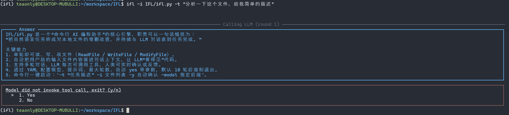
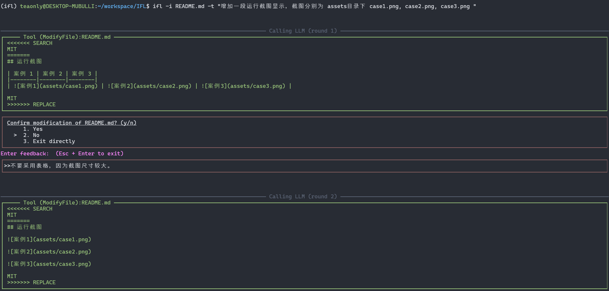
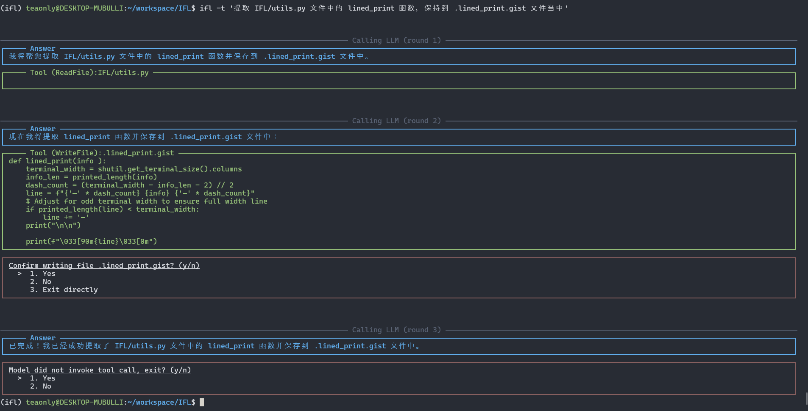

# IFL(I'am Feeling Lucky!)

IFL(I'am Feeling Lucky!) 是一个轻量级、命令行驱动的编码智能体，专为“精密加工”代码场景设计。它通过本地 CLI 与 LLM 配合，半自动完成读取、修改、生成文件等操作，并让用户在每次关键动作前确认，兼顾效率与安全。

## 核心能力

- **文件级工具**：ReadFile / WriteFile / ModifyFile（SEARCH/REPLACE 风格）
- **多轮对话**：支持多轮连续交互，直到任务完成或用户主动退出
- **多模型支持**：已内置 GLM-4.5、SiliconFlow-Kimi 等，通过 config.yaml 一键切换
- **上下文透明**：所有模型调用的提示词、消息均可控，用户轻松调整
- **本地优先**：所有文件操作均在本地执行，无需联网即可工作（LLM 除外）

## 安装

```bash
# 克隆仓库
git clone https://github.com/teaonly/IFL.git
cd IFL

# 创建虚拟环境（推荐 Python 3.12）
python -m venv .venv
source .venv/bin/activate  # Windows 请用 .venv\Scripts\activate

# 安装依赖
pip install -e .
```

## 快速开始

1. 把 LLM 的 API Key 写入环境变量：
   ```bash
   export SF_API_KEY="your-siliconflow-key"   # 使用 SiliconFlow
   # 或
   export BIGMODEL_API_KEY="your-glm-key"     # 使用 GLM
   ```

2. 运行示例（修改单个文件）：
   ```bash
   ifl -t "把 utils.py 里的所有 print 改为 loguru logger" -i utils.py
   ```

3. 运行示例（读取多个文件后生成新文件）：
   ```bash
   ifl -t "根据 a.py 和 b.py 生成单元测试，保存为 test_ab.py" -i a.py -i b.py
   ```

4. 交互模式（未提供 `-t` 时自动进入）：
   ```bash
   ifl
   ```

运行截图：

* 快问快答


* 修改文件


* 生成文件



## 配置说明

`IFL/config.yaml` 里可调整：
- `Model.selected`：切换 LLM 提供商
- `MaxRounds`：最大对话轮数（默认 10）
- `SystemPrompt`：系统提示词，可自定义工具描述与代码风格
- `AcceptTemplate / RefuseTemplate / ChangeFailedTemplate`：三种交互反馈模板

## 命令行参数

```
ifl [-h] [-t TASK] [-i INPUTS [INPUTS ...]]

选项：
  -t, --task     任务描述，省略则进入交互式输入
  -i, --inputs   需要提前读入的文件列表，可多次指定
```

## 典型工作流

1. 用户输入任务 → 2. LLM 规划步骤 → 3. 工具调用（读/写/改） → 4. 终端打印 diff/内容 → 5. 用户确认或反馈 → 6. 回到 2. 直到任务完成

## 安全与免责声明

- 每次写盘前都会询问确认，防止误操作
- 建议在 Git 仓库内使用，可快速回滚
- 本项目仅提供智能体运行流程，生成内容均由所选 LLM 返回，请自行审查

## License

MIT
